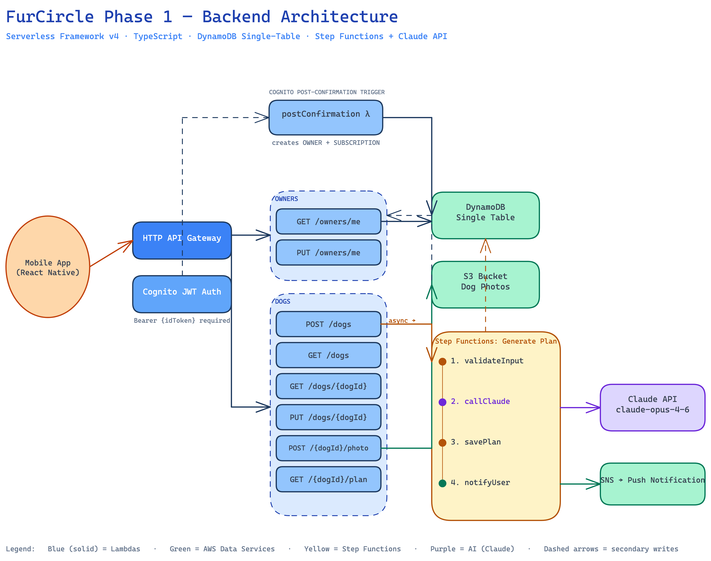

# FurCircle Backend — Phase 1

AI-powered dog wellness plans. Serverless backend built with AWS Lambda, DynamoDB, Step Functions, and Claude.

**Stack:** TypeScript · Serverless Framework v4 · AWS Lambda · DynamoDB (single-table) · Cognito · Step Functions · Claude API (claude-opus-4-6) · S3

---

## Architecture



> Full diagram: `docs/architecture-phase1.excalidraw` (open in [excalidraw.com](https://excalidraw.com))

**Request flow:**
1. Mobile app authenticates with Cognito → receives `idToken`
2. All API calls hit HTTP API Gateway with `Authorization: Bearer {idToken}`
3. Cognito JWT Authorizer validates token, injects `sub` (userId) into Lambda context
4. Lambda reads/writes DynamoDB single-table

**Async plan generation (triggered by `POST /dogs`):**
1. `createDog` Lambda writes dog record + starts Step Functions execution (non-blocking)
2. Step Functions runs: `validateInput` → `callClaude` → `savePlan` → `notifyUser`
3. Mobile polls `GET /dogs/{dogId}` until `planStatus=ready`, or waits for push notification

**Signup flow (no HTTP call needed):**
- User signs up via Cognito (email + OTP)
- Cognito fires `postConfirmation` Lambda trigger
- Lambda creates `OWNER` + `SUBSCRIPTION` records in DynamoDB, adds user to `owners` group

---

## API Reference

**Base URL:** `https://{apiId}.execute-api.us-east-1.amazonaws.com/dev`

All endpoints require: `Authorization: Bearer {idToken}`

All responses: `Content-Type: application/json`

---

### Owner Endpoints

#### `GET /owners/me`
Returns the authenticated owner's profile and subscription.

**Response 200:**
```json
{
  "userId": "cognito-uuid",
  "firstName": "Joshua",
  "lastName": "Smith",
  "email": "joshua@example.com",
  "pushToken": null,
  "referralCode": "FUR4X2",
  "subscription": {
    "plan": "welcome",
    "creditBalance": 0,
    "status": "active",
    "currentPeriodEnd": null
  },
  "createdAt": "2026-04-15T10:00:00Z"
}
```

---

#### `PUT /owners/me`
Update owner profile. All fields optional.

**Request body:**
```json
{
  "firstName": "Josh",
  "lastName": "Smith",
  "pushToken": "ExponentPushToken[xxxx]"
}
```

**Response 200:** Updated owner object.

---

### Dog Endpoints

#### `POST /dogs`
Create a dog profile and trigger async AI plan generation.

**Request body:**
```json
{
  "name": "Buddy",
  "breed": "Golden Retriever",
  "ageMonths": 3,
  "adoptedFromShelter": false,
  "spayedNeutered": "not_yet",
  "medicalConditions": "None known",
  "additionalNotes": "On puppy food, no allergies",
  "environment": "Apartment, no other pets"
}
```

**Validation:**
- `name`: required, 1–50 chars
- `breed`: required
- `ageMonths`: required, 0–240
- `spayedNeutered`: required — `"yes"` | `"no"` | `"not_yet"`

**Response 201:**
```json
{
  "dogId": "uuid",
  "name": "Buddy",
  "breed": "Golden Retriever",
  "ageMonths": 3,
  "planStatus": "generating",
  "createdAt": "2026-04-15T10:00:00Z"
}
```

> Poll `GET /dogs/{dogId}` until `planStatus=ready`, or listen for push notification.

---

#### `GET /dogs`
List all dogs for the authenticated owner.

**Response 200:**
```json
{
  "dogs": [
    {
      "dogId": "uuid",
      "name": "Buddy",
      "breed": "Golden Retriever",
      "ageMonths": 3,
      "photoUrl": "https://...",
      "wellnessScore": 72,
      "planStatus": "ready"
    }
  ]
}
```

---

#### `GET /dogs/{dogId}`
Get full dog profile. Returns `403` if dog belongs to a different owner.

**Response 200:**
```json
{
  "dogId": "uuid",
  "ownerId": "cognito-uuid",
  "name": "Buddy",
  "breed": "Golden Retriever",
  "ageMonths": 3,
  "dateOfBirth": "2026-01-15",
  "photoUrl": "https://...",
  "adoptedFromShelter": false,
  "spayedNeutered": "not_yet",
  "medicalConditions": "None known",
  "environment": "Apartment, no other pets",
  "wellnessScore": 72,
  "planStatus": "ready",
  "healthRecords": [],
  "createdAt": "2026-04-15T10:00:00Z"
}
```

---

#### `PUT /dogs/{dogId}`
Update dog profile. All fields optional. Returns `403` if not owner.

**Request body:** same shape as `POST /dogs` (all fields optional).

**Response 200:** Updated dog object.

---

#### `POST /dogs/{dogId}/photo`
Get a presigned S3 URL to upload a dog photo directly from the mobile client.

**Request body:**
```json
{ "contentType": "image/jpeg" }
```
Accepts: `image/jpeg` or `image/png`

**Response 200:**
```json
{
  "uploadUrl": "https://...s3.amazonaws.com/dogs/uuid/profile.jpg?X-Amz-Signature=...",
  "photoUrl": "https://...s3.amazonaws.com/dogs/uuid/profile.jpg",
  "expiresIn": 300
}
```

**Mobile flow:**
1. `POST /dogs/{dogId}/photo` → get `uploadUrl`
2. `PUT {uploadUrl}` with raw image bytes + `Content-Type: image/jpeg`
3. `PUT /dogs/{dogId}` with `{ "photoUrl": "..." }` to persist the URL

---

#### `GET /dogs/{dogId}/plan`
Get the current month's AI-generated wellness plan.

**Response 200 (ready):**
```json
{
  "dogId": "uuid",
  "month": "2026-04",
  "ageMonthsAtPlan": 3,
  "whatToExpect": "Your Golden Retriever is at peak learning capacity...",
  "whatToDo": [
    { "text": "Teach sit, come, down and stay. Five-minute sessions three times daily." }
  ],
  "whatNotToDo": [
    { "text": "Don't take to off-leash dog parks — not fully vaccinated." }
  ],
  "watchFor": [
    { "text": "Excessive hiding when meeting new people." }
  ],
  "earlyWarningSigns": [
    { "text": "Persistent limping", "action": "See a vet immediately." }
  ],
  "comingUpNextMonth": "Month 4 focuses on adolescence boundaries.",
  "milestones": [
    { "emoji": "🐾", "title": "Socialisation window closing", "description": "..." }
  ],
  "wellnessScore": 72,
  "generatedAt": "2026-04-15T10:30:00Z"
}
```

**Response 200 (still generating):**
```json
{ "dogId": "uuid", "month": "2026-04", "planStatus": "generating" }
```

---

### Error Responses

All errors follow this shape:
```json
{ "error": "DOG_NOT_FOUND", "message": "No dog found with id abc123" }
```

| Status | Error code | When |
|--------|------------|------|
| 400 | `VALIDATION_ERROR` | Invalid request body |
| 401 | `UNAUTHORIZED` | Missing or invalid token |
| 403 | `FORBIDDEN` | Dog belongs to different owner |
| 404 | `DOG_NOT_FOUND` | Dog does not exist |
| 500 | `INTERNAL_ERROR` | Unexpected server error |

---

## Local Development

```bash
# Install dependencies
npm install

# Load deployed stack outputs into .env.test
npm run env:load

# Run unit tests (no AWS needed)
npm test

# Run integration tests (requires deployed dev stack)
npm run test:integration
```

## Deploy

```bash
# Deploy to dev
npx serverless deploy --stage dev

# Deploy to prod
npx serverless deploy --stage prod
```

CI/CD: GitHub Actions deploys to `dev` automatically on merge to `main` (OIDC auth, no static keys).

---

## Docs

| File | Contents |
|------|----------|
| `docs/spec-phase1-auth-onboarding.md` | Full Phase 1 spec with DynamoDB keys, IAM permissions |
| `docs/dynamodb-table-design.md` | Single-table design (all phases) |
| `docs/architecture-phase1.excalidraw` | Architecture diagram (editable) |
| `tasks/plan.md` | Implementation plan |
| `tasks/todo.md` | Task checklist |
